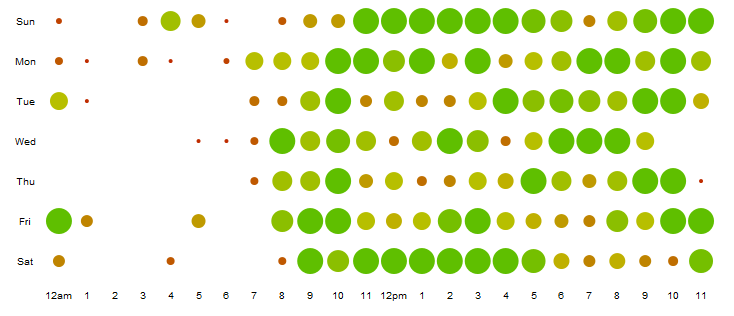

MediaWiki Changelog Graphs
==========================

Adds a special page showing a chart of wiki edits broken down by day, hour and month

How to Install
==============
* Download this tarball and extract the contents to $IP/extensions/CollapsableText where $IP is your root wiki install
* Add 'require( "extensions/CollapsableText/CollapsableText.php");' to your LocalSettings (without the single quotes)
* Visit Special:ChangeGraphs

